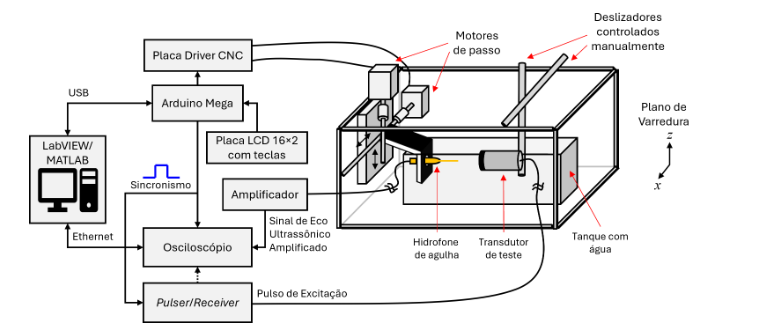

<p align="center">
  <b>Language / Idioma:</b> <a href="#english">English</a> · <a href="#português">Português</a>
</p>

---

# 2D Ultrasonic Transducer Characterization System

[](https://youtu.be/y6sX9zQ8jUQ)

> **Demonstração do Projeto / Project Presentation**  


> **Artigo / Article** — Desenvolvimento de uma Plataforma de Baixo Custo para Varredura 2D e Caracterização de Campos Acústicos Ultrassônicos / Development of a Low-Cost Platform for 2D Scanning and Characterization of Ultrasonic Acoustic Fields 
> 
> **Autores / Authors:** Ana Laura Waideman de Oliveira · Ana Clara Annunciato de Oliveira · Alexia Marcon Watzlawick · Gilson Maekawa Kanashiro · Joaquim Miguel Maia · Amauri Amorin Assef
>
> **Instituição / Institution:** Universidade Tecnológica Federal do Paraná (UTFPR) — Campus Curitiba

---

<a name="português"></a>
## Português

### Resumo do Projeto
Sistema de varredura bidimensional (2D) de baixo custo para o mapeamento e caracterização espacial de campos de pressão emitidos por transdutores de ultrassom. A plataforma combina movimentação mecânica de precisão micrométrica com controle híbrido (manual via teclado LCD e autônomo via software em LabVIEW), integrado ao sincronismo de disparo de pulsadores e aquisição via osciloscópio.

### Arquitetura do Sistema
O diagrama abaixo ilustra a integração entre a estrutura de movimentação mecânica, a eletrônica de controle e o software de automação:

<p align="center">
  
</p>

### Especificações Técnicas & Hardware
* **Microcontrolador:** Arduino Mega 2560
* **Escudo de Controle:** CNC Shield V3
* **Drivers de Passo:** DRV8825 configurados em micropasso de 1/32 (resolução de 0,056° por micropasso)
* **Atuadores:** 2x Motores NEMA 17 com eixos lineares e fusos roscados TR8×2
* **Alimentação:** Fonte chaveada dedicada de 12 V / 20 A (motores) com isolamento da lógica (5 V)
* **Instrumentação Externa:** Pulser/Receiver Olympus 5077PR e Osciloscópio Tektronix MDO3014
  
### Lista de Materiais e Equipamentos
Para consultar a especificação completa de componentes e a planilha de custos do projeto, acesse a [Pasta de Documentação](documentacao/).

* ### Softwares e Firmwares
* **[LabVIEW (2026 Q1)](https://www.ni.com/pt-br/support/downloads/software-products/download.labview.html):** Interface gráfica de controle autônomo e envio da matriz de coordenadas via USB.
* **[Arduino IDE (v2.3.8)](https://www.arduino.cc/en/software):** Firmware em C/C++ baseado nas bibliotecas `AccelStepper` e `LiquidCrystal`.

### Estrutura do Repositório

```text
2D-Ultrasonic-Transducer-Characterization-System/
├── documentacao/
│   ├── projectOverview.png
│   └── lista_de_materiais.xlsx
├── firmware-arduino/
│   └── firmware_arduino.ino
├── software-labview/
│   └── sistema_labview.vi
└── README.md

```

<a name="english"></a>
## English

### Project Overview
A low-cost two-dimensional (2D) scanning system designed for spatial mapping and pressure field characterization of ultrasonic transducers. The platform combines micrometric mechanical positioning with hybrid control (manual adjustment via LCD keypad and autonomous execution via LabVIEW), integrated with sync pulse generation for pulser excitation and oscilloscope acquisition.

### System Architecture
The diagram below illustrates the integration between mechanical positioning, control electronics, and automation software:

<p align="center">
  
</p>

### Technical Specifications & Hardware
* **Microcontroller:** Arduino Mega 2560
* **Control Shield:** CNC Shield V3
* **Stepper Drivers:** DRV8825 with 1/32 microstepping configuration (0.056° microstep resolution)
* **Actuators:** 2x NEMA 17 Stepper Motors with linear shafts and TR8×2 lead screws
* **Power Supply:** Dedicated 12 V / 20 A switching power supply isolated from 5 V logic
* **External Instrumentation:** Olympus 5077PR Pulser/Receiver and Tektronix MDO3014 Oscilloscope

### Bill of Materials & Equipment
To view the full component specifications, and cost breakdown, access the [Documentation Folder](documentacao/).

### Software & Firmware
* **[LabVIEW (2026 Q1)](https://www.ni.com/pt-br/support/downloads/software-products/download.labview.html):** Graphical user interface for autonomous control and serial USB transmission of coordinates.
* **[Arduino IDE (v2.3.8)](https://www.arduino.cc/en/software):** C/C++ firmware built with `AccelStepper` and `LiquidCrystal`.

### Repository Structure

```text
2D-Ultrasonic-Transducer-Characterization-System/
├── documentacao/
│   ├── projectOverview.png
│   └── lista_de_materiais.xlsx
├── firmware-arduino/
│   └── firmware_arduino.ino
├── software-labview/
│   └── sistema_labview.vi
└── README.md
---
